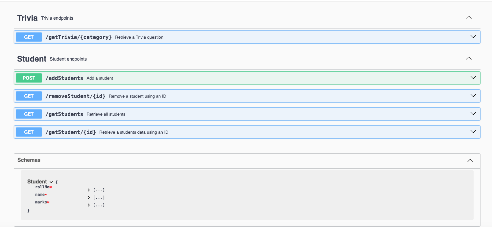

# student-svc

| API | http://localhost:9000/api/swagger-ui/index.html#/ |
|-----|--------------------------------------------------------|

## Overview
This module was created to manage students in a school. It is a simple CRUD application that allows you to create, read, update and delete students.
I created this very simple API to demonstrate how to create a simple CRUD application using Spring Boot framework
I kept the solution simple enough to articulate my abilities but complex enough to demonstrate my understanding of SOLID principles.
This services utilises a database and uses a single downstream integration to a 3rd party API to demonstrate how to integrate with external services.

##Dependencies

### Database
PostgreSql create scripts are included in `/resources`. Use them to create a database for local testing.

* For the storage of student schema we use the student database: `student`

### Service Flows
This service has 1 downstream services that it interacts with, where is:
1. api.api-ninjas.com

 Here is a list of the endpoints along with its purpose and downstream flow:
1. getStudents - This endpoint is used to retrieve all students in DB. 
flow: ```student-svc -> postgres DB```
2. getStudent - This endpoint is used to retrieve a students in DB using the provided ID.
flow: ```student-svc -> postgres DB```
3. addStudents - This endpoint is used to add a students details into the DB.
flow: ```student-svc -> postgres DB```
4. removeStudent - This endpoint is used to remove a student from the DB using the provided ID.
flow: ```student-svc -> postgres DB```
5. getTrivia - This endpoint is used to retrieve a Trivia question and answer from the 3rd party downstream.
flow: ```student-svc -> api-ninjas.com```

